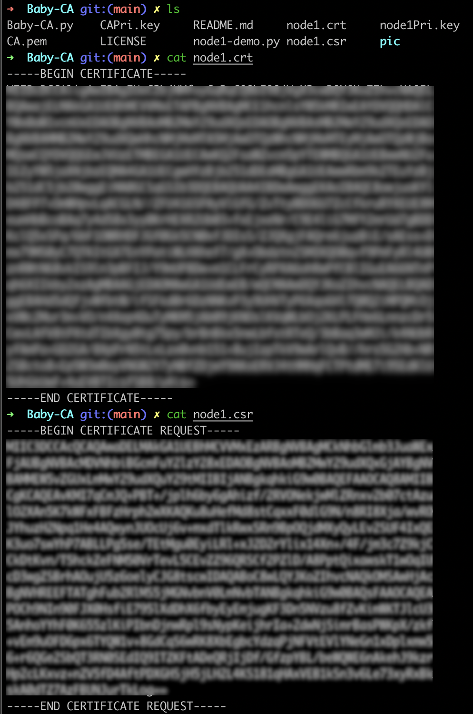

# Baby-CA

This is a baby CA working in lab/intranet

## RSA Signature Scheme

$n = pq$, p, q are large secret primes

Message space $\mathbb{P} = \mathbb{Z}_n$

Signature space $\mathbb{A} = \mathbb{Z}_n$

Key space $\mathbb{K} = \{(n, p, q, a, b) | n = pq, ab \equiv 1 \mod \phi(n)\}$

> $1 \lt e \lt \phi(N)$ such that gcd(e, $\phi(N)$) = 1. Compute d such that $ed \equiv 1 \mod \phi(N)$

**Sign**

Given a message x and private key K=(p, q, a)

$sig_K(x) = x^a \mod n$

**Verify**

Given a message x with signature y and public key (n, b), compute

$ver_K(x, y) = true \Leftrightarrow x \equiv y^b (\mod n)\ for\ x,y \in \mathbb{Z}_n$


## Communication


**CA**

Generate private key `CAPri.key` and CA cert `CA.pem`. CA acts as root CA.

```bash
openssl genrsa -des3 -out CAPri.key 2048
openssl req -x509 -new -nodes -key CAPri.key -sha256 -days 365 -out CA.pem
```

Then run `Baby-CA.py`

**Node 1**

Generate private key `node1Pri.key` and generate CSR `node1.csr` (cert request)

```bash
openssl genrsa -out node1Pri.key 2048
openssl req -new -key node1Pri.key -out node1.csr
```

**CA**

Generate cert `node1.crt` with CSR

```bash
openssl x509 -req -in node1.csr -CA CA.pem -CAkey CAPri.key -CAcreateserial -out node1.crt -days 365 -sha256
```

**Node 1**

Sign `to-sign.txt` using the private key `node1Pri.key`. Get the signature `signature.txt`

```bash
openssl dgst -sha256 -sign node1Pri.key -out signature.txt to-sign.txt
```

**Node 2**

To verify the signature `signature.txt`, first load the cert `node1.crt`, then verify. If `to-sign.txt` is changed, verification failure will occur.

```bash
openssl x509 -in node1.crt
openssl dgst -sha256 -verify <(openssl x509 -in node1.crt -pubkey -noout) -signature signature.txt to-sign.txt
```

## Use

**CA**
First

```bash
openssl genrsa -des3 -out CAPri.key 2048
openssl req -x509 -new -nodes -key CAPri.key -sha256 -days 365 -out CA.pem
```


